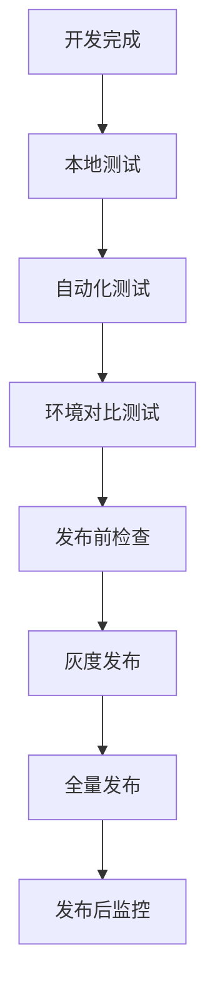

# 测试和发布流程指南

## 测试流程图

## 测试环境配置清单
- [ ] 环境变量检查
  - DEEPSEEK_API_KEY 格式验证
  - API 域名配置确认
  - 端口配置检查
- [ ] 日志系统配置
  - 错误日志记录
  - 性能指标监控
  - 问题追踪系统

## 自动化测试流程
1. 单元测试
   - API 调用测试
   - 错误处理测试
   - 参数验证测试

2. 集成测试
   - 完整功能流程测试
   - 性能压力测试
   - 并发请求测试

3. 环境对比测试
   - 测试环境 vs 生产环境
   - 记录环境差异
   - 分析潜在问题

## 发布前检查清单
1. 代码检查
   - [ ] 所有测试通过
   - [ ] 代码审查完成
   - [ ] 文档更新完成

2. 环境检查
   - [ ] 生产环境配置验证
   - [ ] 数据备份确认
   - [ ] 回滚方案准备

3. 监控准备
   - [ ] 日志系统就绪
   - [ ] 告警机制配置
   - [ ] 性能监控工具

## 发布后验证
1. 功能验证
   - [ ] 核心功能测试
   - [ ] 错误处理验证
   - [ ] 用户体验确认

2. 性能监控
   - [ ] 响应时间监控
   - [ ] 错误率监控
   - [ ] 资源使用监控

3. 问题处理流程
   - 记录问题详情
   - 快速响应机制
   - 更新问题库 